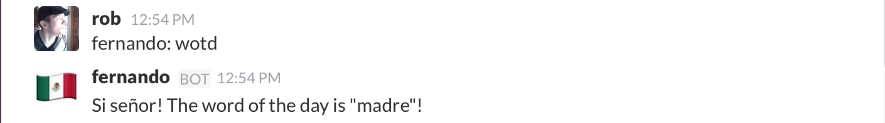

# Taco-slackbot



taco-slackbot is a [Slack](https://slack.com) bot that connects to a
[tacoday-api](https://github.com/misterdjules/tacoday-api)
server instance and responds to one command that gives the "word of the day"
that can be used at a local tacos restaurant in Vancouver to get special
deals.

It was made as a toy project to experiment with
[Triton](https://www.joyent.com), [Docker](https://www.docker.com), [HashiCorp
Vault](https://www.vaultproject.io) and other technologies that are related to
using containers to deploy software.

## How to run taco-slackbot?

### Standalone

The bot needs three pieces of information to run:

1. A Slack token to connect to the Slack server and authenticate itself
2. The hostname of the [tacoday-api](https://github.com/misterdjules/tacoday-api) server instance to connect too to get the "word of the day"
3. The port of the [tacoday-api](https://github.com/misterdjules/tacoday-api) server instance

They are all set using environment variables. Let's assume that an instance of
a [tacoday-api](https://github.com/misterdjules/tacoday-api) server is running
on the same machine, taco-slackbot can be started with the following command
line:

```
TACODAY_API_HOST='localhost' SLACK_TOKEN=your_slack_token node index.js
```

### From the docker command line

This repository also contains a `Dockerfile` that can be built to create a
Docker image, and then ran as a Docker container.

Simply build the Docker image with:

```
docker build -t username/image-name:tag .
```

and then run it with:
```
docker run -d --name taco-slackbot --restart=always -e "SLACK_TOKEN=your_slack_token" -e "TACODAY_API_HOST=tacoday-api-host" jgilli/taco-slackbot
```

It is also possible to link the taco-slackbot container to an instance of a
[tacoday-api](https://github.com/misterdjules/tacoday-api) server that is
already running as Docker container. In this case, the `TACODAY_API_HOST`
environment variable should not be set, as the host of the
[tacoday-api](https://github.com/misterdjules/tacoday-api) server instance
is determined using Docker links:

```
docker run -d --name taco-slackbot --restart=always -e "SLACK_TOKEN=your_slack_token" --link tacoday_api:tacoday_api jgilli/taco-slackbot
```

### With docker-compose

Finally, both the [tacoday-api](https://github.com/misterdjules/tacoday-api)
server instance and the taco-slackbot can be started at the same time with
[docker-compose](https://docs.docker.com/compose/) by using the [tacobot GitHub
repository](https://github.com/misterdjules/tacobot).
